### Kubernetes for Dummies, Literally

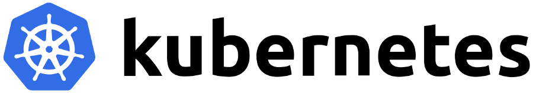

Kubernetes, an often coupled technology with Docker, was something I
wanted to write about after receiving a lot of response on my piece
"[Docker for rookies
🐳](https://medium.com/@devangtomar/how-to-get-started-with-docker-b2d924cbe9bb)"
If you haven't already, please read Docker for Rookies 🐳
[here](https://medium.com/@devangtomar/how-to-get-started-with-docker-b2d924cbe9bb).
Knowing how to use a container service like Docker is essential for
understanding Kubernetes. Actually, Kubernetes can manage more container
runtimes that are not addressed in this article. In this article, I'll
describe Kubernetes, the issues it uses containers to address, and how
you can start utilizing it right away.

<br>
<br>

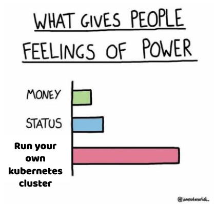

Kubernetes successfully manages containerized apps by automating
procedures. It is not, however, as easy to use as it first appears. A
full understanding of Kubernetes' operation is crucial because dealing
with it and its deployment process presents security concerns as well.
You may learn more about Kubernetes in this post, including its
advantages and disadvantages as well as how to implement it properly.
Let's look more closely.

<br>

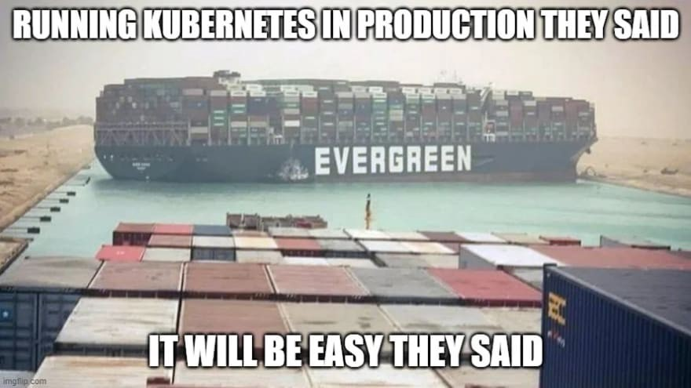

<br>

### An Overview of Kubernetes 🆕

The name Kubernetes is taken from the Greek word κυβερvήτης
(kubernḗtēs), which meaning helmsman or pilot. The ship's wheel in the
Kubernetes logo reinforces the sense of managing or piloting, which is
precisely what Kubernetes accomplishes with Docker containers. It is not
necessary to manage Docker containers manually because Kubernetes
handles them in a number of ways. Due to the 8 characters between "K"
and "s," Kubernetes is frequently abbreviated as "K8s" for convenience.
From this point forward, I'll refer to Kubernetes as K8s.

<br>

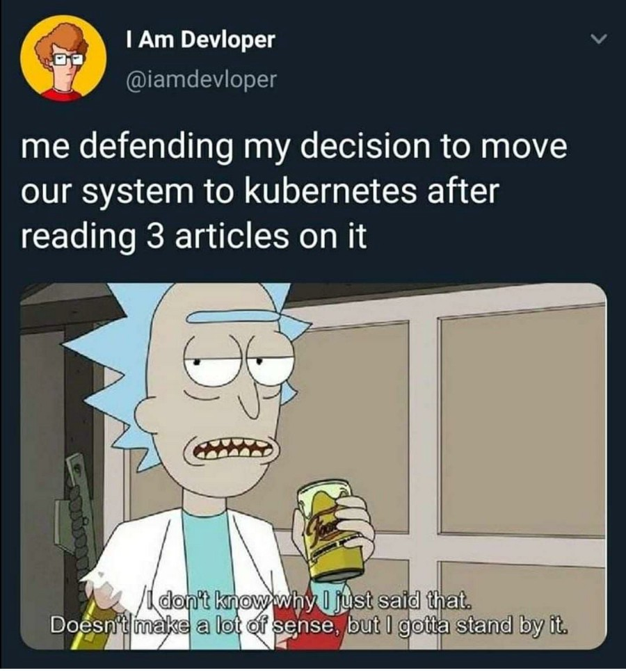

<br>

The use of K8s further decouples networks, storage, and machines from
their actual physical implementation. Managing several containers
manually might lead to problems comparable to managing virtual machines,
as was mentioned in the previous piece. However, since cloud providers
charge you for things like compute time and storage, controlling
containers is very crucial. For this reason, you don't want to have a
lot of idle containers running. Additionally, you don't want one
container to take on more network load than it can manage on its own.
K8s was created to address issues like these.

### What services does K8s provide? 🤔

<br>


<br>

- **Service discovery and load balancing :** In order to stabilize
    > deployments, K8s can route network traffic to other containers and
    > locate a container using a DNS name or IP address.

- **Secret and configuration management :** You may save private data
    > with K8s, including passwords, OAuth tokens, and SSH keys. Without
    > having to rebuild your container images or expose secrets in your
    > stack settings, you may update these secrets and the app
    > configuration.

- **Self-healing :** K8s kills containers that don't respond to your
    > user-defined health check, restarts failing containers, and
    > doesn't advertise them to clients until they are prepared to
    > serve.

- **Automatic bin packing :** To perform containerized processes, you
    > can provide K8s a cluster of nodes and specify the CPU and memory
    > requirements for each container. To optimise resource usage,
    > Kubernetes can automatically fit containers onto nodes.

- **Storage orchestration :** Any storage system you choose can be
    > automatically mounted, whether it is local, hosted by a cloud
    > service like AWS or GCP, or on a network storage system like NFS
    > iSCSI, Gluster, Ceph, Cinder, or Flocker.

- **Automated rollouts and rollbacks :** Deployed containers can be
    > defined in the desired state, and the state can be changed at a
    > regulated rate. For instance, Kubernetes can be automated to
    > generate new containers for your deployment, remove any already
    > present containers, and adopt all of the resources from the old
    > containers to the new ones.

<br>

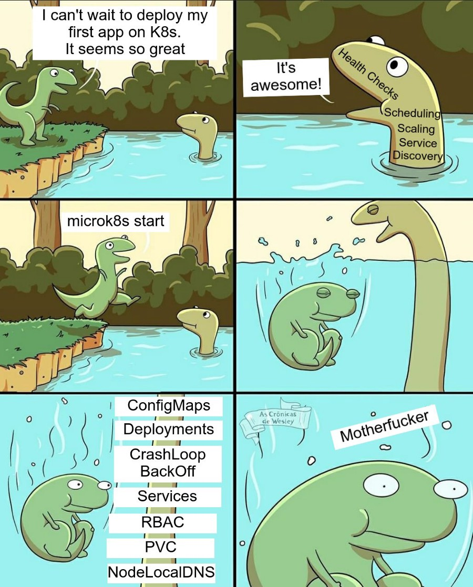

In this article, we'll simply touch the surface of these features.

### Some Definitions 📃

It's crucial to comprehend these fundamental K8s ideas. Once more,
before moving on, you should be conversant with container services like
[Docker](https://medium.com/@devangtomar/how-to-get-started-with-docker-b2d924cbe9bb).

- **Pods :** Groups of one or more containers make up pods. Pods have
    > shared network and storage resources with rules for how to operate
    > containers. They are the tiniest deployable computer units that
    > K8s can generate and operate. Pods operate as a logical unit on
    > nodes as a group, meaning they all have the same IP address but
    > can communicate via localhost. Pods can share storage, but since
    > containers can run on different machines, they are not required to
    > run on the same machine.
<br>

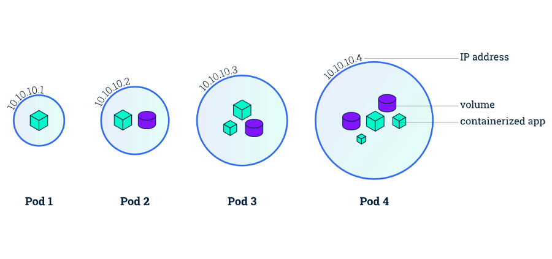

<br>

- **Nodes :** Physical or virtual machines that are not made by K8s
    > are known as nodes. In a cluster, you would typically have
    > numerous nodes, however in a learning environment or one with
    > restricted resources, you might only have one node. Before using
    > K8s to deploy applications, you must have basic infrastructure in
    > place because nodes are established manually or using public cloud
    > services like AWS EC2 or OpenStack. From here, you may define
    > storage, virtual networks, etc. Several pods can run on a single
    > node.

<br>

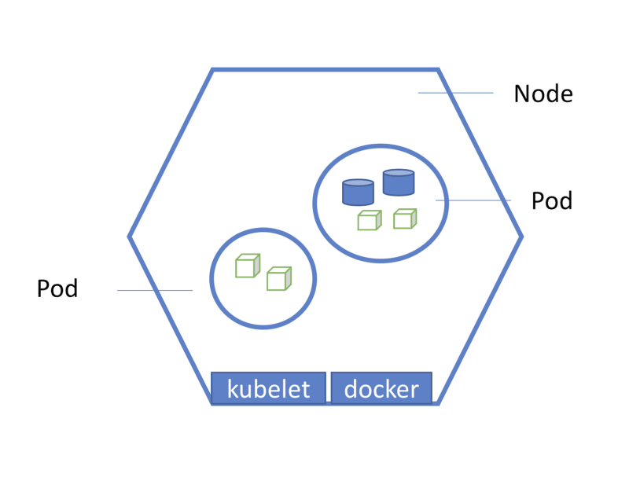

<br>

- **Deployments :** A group of Pods make up a deployment. A deployment
    > makes sure that there are enough active Pods to support the app at
    > once. By taking a look at data like CPU use, deployments can also
    > shut down Pods that are not required.

<br>


<br>

### Let's begin to use K8s ⭐

For easy setup just get **Docker Desktop** onyour machine. Link to it is
below :

**Docker Desktop :** <https://www.docker.com/products/docker-desktop/>

I'll be utilizing **Minikube** and **Kubectl** to run K8s locally. The
most recent versions of Minikube and Kubectl can be installed using :

*Minikube : <https://minikube.sigs.k8s.io/docs/start/>*

*Kubectl : <https://kubernetes.io/docs/tasks/tools/>*

Please be aware that in order to continue with this tutorial, you must
also have [Docker](https://docs.docker.com/engine/install/) installed.

<br>

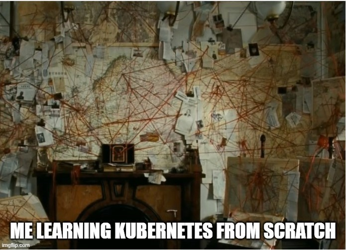

<br>

#### 1. Install prerequisites ⚙️

Use `docker --version` and `minikube version` and `kubectl version` We will
deal with the notification that says the connection to localhost:8080
was rejected later, so don't be concerned.

<br>

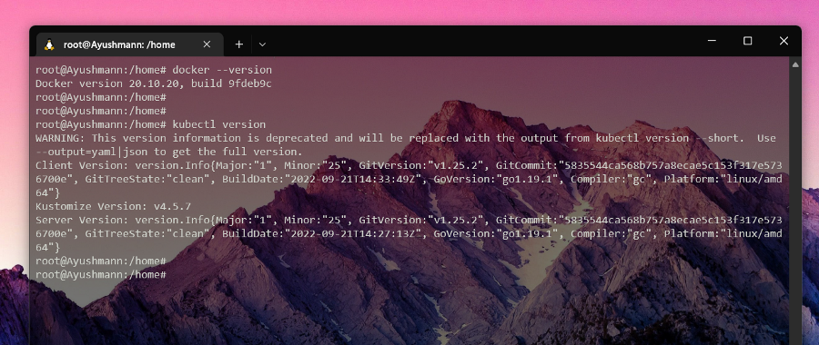

<br>

**Note :** Skipping Minikube's version as I'm using Docker Desktop for
k8s cluster setup.

#### 2. Creating a deployment 🏗️

By executing kubectl get pod, we can see the Pods. You shouldn't have
any pods at this time, and it will say "No resources detected in default
namespace."

The smallest component of the K8s cluster is the pod, however in actual
use, deployments are what are created.

The command to use create a **kubernetes deployment** is :

`kubectl create deployment <NAME\> --image=<image>`

Now we will create a nginx deployment for this specific deployment:

`kubectl create deployment nginx-depl --image=nginx`

**Note :** NGINX is an open-source webserver that is used to create
server-side applications, for those who are unaware.

Now, the output we get from running :

`kubectl get deployment`

and

`kubectl get pod`

is as follows.

<br>

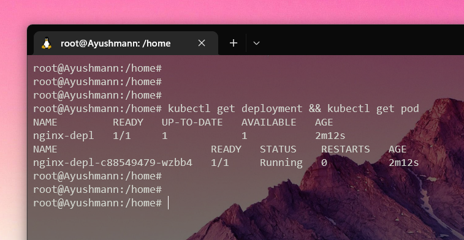

<br>

Our usage of :

`kubectl create deployment <NAME> --image=<image>`

This is the simplest method of creating a deployment. The deployment
continues with the default settings. **ReplicaSet** is a layer between
the deployment and the pod that is automatically managed by K8s
deployment.

<br>


<br>

The **ReplicaSet** describes how to find Pods that it can acquire, how
many Pods it should be maintaining, and the data for new Pods that
should be created to satisfy the number of replicas need. In order to
attain the specified number, a **ReplicaSet** creates and deletes Pods
as necessary. A **ReplicaSet** uses its Pod template to produce new Pods
when necessary.

We can view the **ReplicaSet** with :

`kubectl get replicaset`

<br>

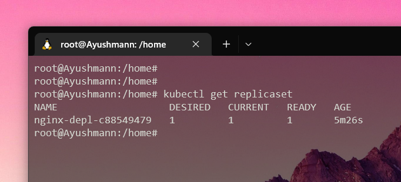

<br>

The ReplicaSet ID, c88549479, is visible after the deployment name. As
was previously stated, the ReplicaSet is a layer that resides between
the Deployment and the Pod. You may have noticed that the ReplicaSet ID
is contained in the ID for the Pod.

In summary, this is how Abstraction's layers function. A Pod is an
abstraction of a container, and a Deployment controls a ReplicaSet,
which manages all the replicas of the Pod.

#### 3. Edit the Deployment 🔨

Change your deployment utilising:

`kubectl edit deployment nginx-depl`

The automatically created configuration file will be displayed. Rest
assured that you are not required to comprehend every detail of the
configuration file at this time. We will just modify the picture version
of the file, which is located somewhere in the centre, for the purposes
of this tutorial.

**Previously**

<br>

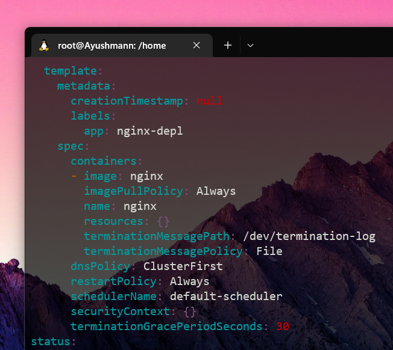

<br>

Now

Notice the nginx image version change to 1.19 :

`nginx:1.19`

<br>

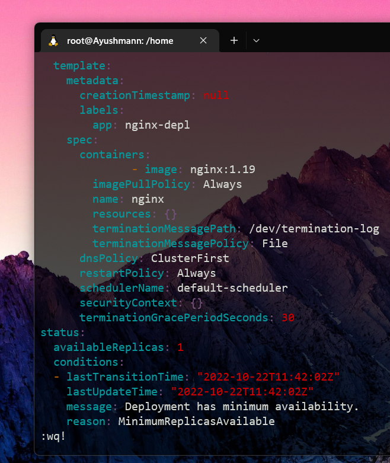

<br>

When you are finished editing, type :wq for write & quit. By doing this,
the old picture will be terminated and a new one made.

<br>

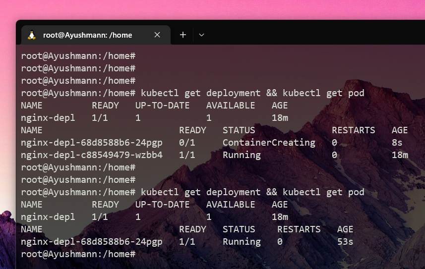

<br>

We can see that the old replicaset has no pods in it and a new one has
also been formed after using the kubectl get replicasetcommand.

<br>

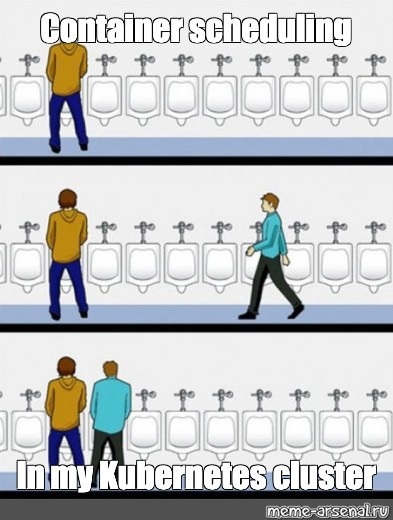

<br>

#### 4. Debugging Pods 🧑🏻‍💻🐛

Another useful command is :

`kubectl logs <Pod Name>`

Because nginx did not log anything, you will receive nothing if you run
this on it. We can utilise MongoDB, a document database, to show off
logs.

`kubectl create deployment mongo-depl --image=mongo`

<br>

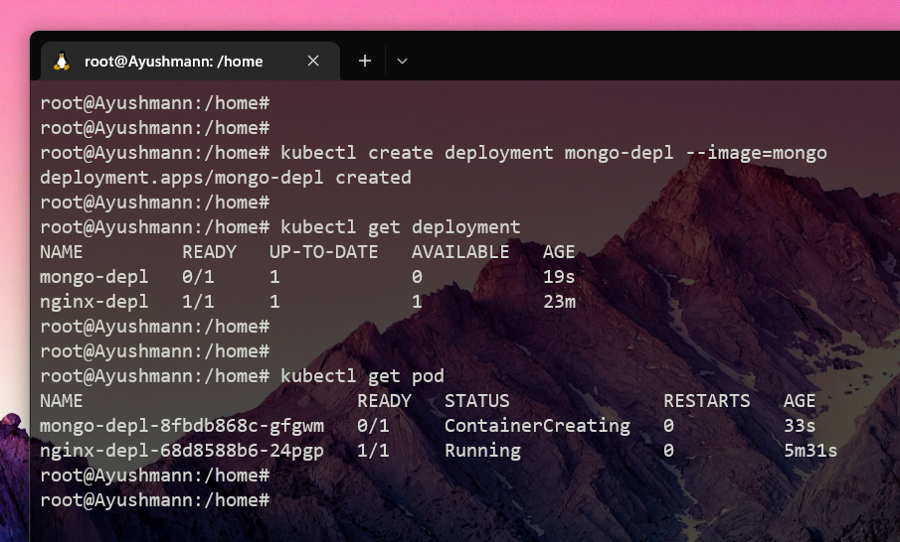

<br>

Now executing kubectl logs mongo-depl-8fbd868c-gfgwmwill produce concise
logs and kubectl describe pod mongo-depl-8fbd868c-gfgwmwill produce a
more verbose output.

If something goes wrong, logging will assist with debugging, and
description creates something a little more understandable.

Another useful command to see what is going on inside the Pod is *(-it
stands for interactive terminal)*:

`kubectl exec -it <Pod Name> --bin/bash`

Consider how we might use this to access our MongoDB pod:

`kubectl exec -it mongo-depl-8fbd868c-gfgwm --bin/bash`

and if we echo inside and do all sort of commands inside it. To exit
this, simply type exit.

<br>

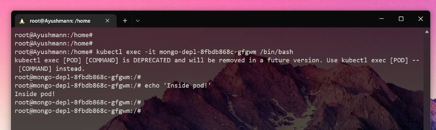

<br>

#### 5. Deleting deployments ❌☠️

All of the Pods contained in a Deployment are deleted when the
Deployment is deleted. To remove, as an illustration, the MongoDB
Deployment type :

`kubectl delete deployment mongo-depl`

**WARNING**! : You should be careful not to delete anything significant
or on production clusters while using the following instructions.

With this command, all the pods in a single namespace can be deleted :

`kubectl delete --all pods --namespace=foo`

You can also delete every deployment in a namespace, which will also
destroy every pod associated with that namespace's deployments.

`kubectl delete --all deployments --namespace=foo`

With this command, you can delete all namespaces and all objects within
each namespace (but not unnamespaced objects like nodes and some
events) :

`kubectl delete --all namespaces`

The last command, however, is probably not something you want to use
because it would destroy items from the kube-system namespace, rendering
your cluster useless.

<br>

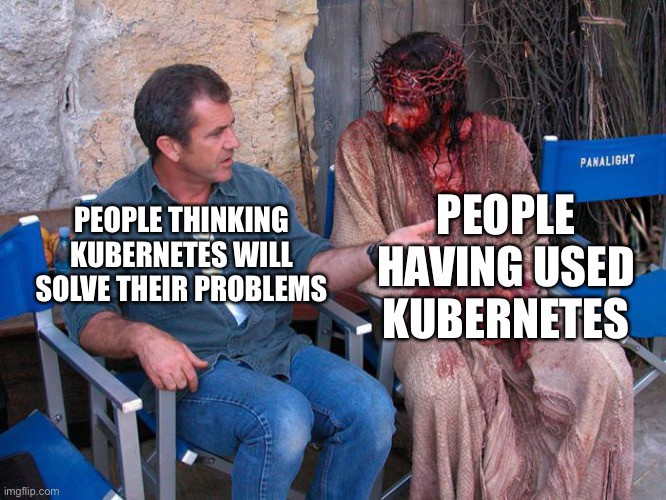

<br>

With the exception of kube-system, this command will erase all
namespaces, which may be useful:

```bash
for each in $(kubectl get ns -o
jsonpath="{.items[*].metadata.name}" | grep -v kube-system);

do

`kubectl delete ns $each`

done
```

#### 6. Apply configuration files 📂

We must first generate a configuration file before we can apply it. Make
a configuration file for the nginx deployment and save it in a place you
can access again.

```bash
touch nginx-deployment.yaml
```

Next, paste the following settings into the file :

```yml
apiVersion: apps/v1
kind: Deployment
metadata:
  name: myapp
  labels:
    app: nginx
spec:
  replicas: 1
  selector:
    matchLabels:
      app: nginx
  template:
    metadata:
      labels:
        app: nginx
    spec:
      containers:
        - name: nginx
          image: nginx:1.19
          ports:
            - containerPort: 80
```

<br>

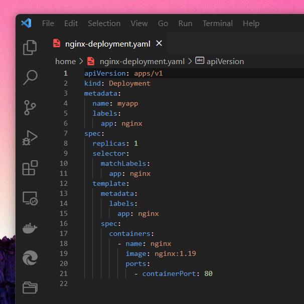

<br>

The design for the Pods can be found under "template." The first
specification tag is for deployments, while the second specification tag
is for pods.

This configuration file basically specifies that we intend to bind one
container inside the pod with an NGINX image to port 80.

When we use :

`kubectl apply -f nginx-deployment.yaml`

It utilises the settings to build a deployment. Let's imagine that
instead of creating one replica, the Deployment was altered in the
configuration file to make four.

We receive the following output after executing kubectl get pod and
kubectl get deployment :

<br>

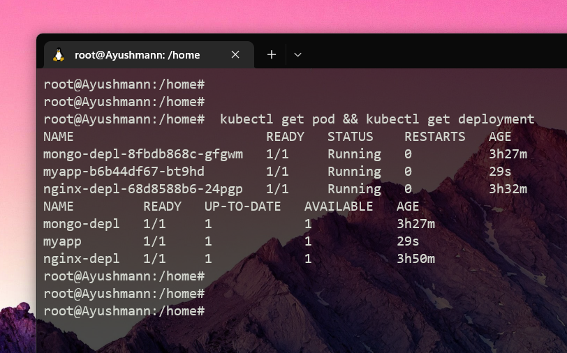

<br>

As you can see, K8s is capable of predicting when to create or update a
deployment.

### Conclusion 🤔

You ought to learn a lot about Kubernetes' foundations by reading this
article. In conclusion, we discovered what Kubernetes is and its broad
range of capabilities. We discovered the services that K8s offers as
well as some crucial definitions. The next step was to investigate CRUD
commands for Deployments using Docker and Kubectl. Finally, we learnt
how to use configuration files for Deployments and debug Pods. It should
be noted that any other K8s component, including services and volumes,
can also be managed via kubectl.

<br>


<br>

### Final thoughts 💭

I sincerely hope you enjoyed reading along and gained some knowledge.
I'm pleased you've made it this far since Kubernetes is a very helpful
tool for managing containers. There is always much more comprehensive
documentation available at <https://kubernetes.io/docs/home/>

Please let me know if I can go into more detail about this topic in the
future, if you have any questions, or if I missed anything. Please leave
me a comment; I truly appreciate it!

<br>


<br>

### GitHub URL for this article 💻

### Let's connect and chat! Open to anything under the sun 🏖️🍹

**🐦 Twitter :** [devangtomar7](https://twitter.com/devangtomar7)\
**🔗 LinkedIn :**
[devangtomar](https://www.linkedin.com/in/devangtomar)\
**📚 Stackoverflow :**
[devangtomar](https://stackoverflow.com/users/8198097/devangtomar)\
**🖼️ Instagram :** [be_ayushmann](https://instagram.com/be_ayushmann)\
Ⓜ️ **Medium :** [Devang
Tomar](https://medium.com/u/8f5e1c86129d?source=post_page-----e42119a306ca--------------------------------)\
☊ **Hashnode :** [devangtomar](https://devangtomar.hashnode.dev/)\
**🧑‍💻 Dev.to :** [devangtomar](https://dev.to/devangtomar)
